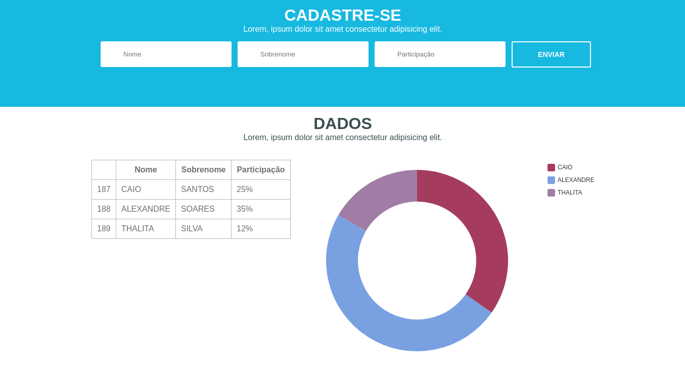

# Test ABStartups
Teste técnico da ABStartups, desenvolvido com Angular6, toda parte de designer foi criada com o pré-processador SASS, na parte do gráfico foi utilizado a biblioteca [NGX-Charts](https://www.npmjs.com/package/@swimlane/ngx-charts).

# Requerido
* Angular 6
* npm

## Como usar
1. clone o repositório: [git@github.com:alexandrejuk/frontendABS.git](git@github.com:alexandrejuk/frontendABS.git) 
2. cd frontendABS
3. npm install
4. npm start (executa a aplicação)

## ScreenShot

## Autor
[Alexandre dos Santos Soares](https://github.com/alexandrejuk)
